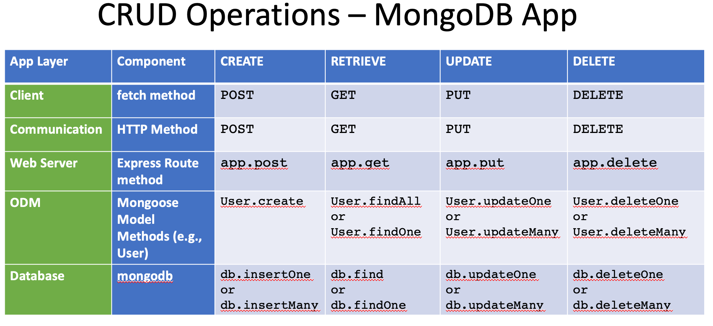
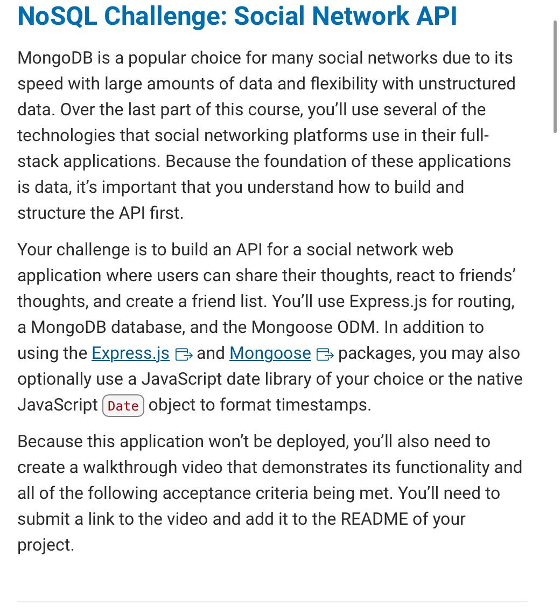

# proj-eight-teen-chall-nosql-social-network-api

An API for a social network web application where users can share their thoughts, react to friends’ thoughts, and create a friend list.

## Description

This project is a social network application, using Mongoose and Express.js, where users can share thoughts, react to friends thoughts, and create a friend list. Express, in this project, is used to define and handle the API Routes, process incoming requests, and send back responses. Mongoose, in this project, is used to define the data models for users thoughts, reactions, and friends lists. Mongoose also handles the connection to the Mongodb database, making it easier to execute CRUD operations and work with data.

This application will not be deployed, so I will provide a video down below of a walk through video, featuring how this works.

## Table of Contents

:bookmark_tabs:

- [Installation](#installation)
- [Links](#links)
- [Mongodb](#mongodb)
- [Mongoose](#mongoose)
- [Differences Between MySQL and NoSQL](#differences-between-mysql-and-nosql)
- [MISC](misc)
- [License](#license)
- [Project Requirements](#project-requirements)
- [How to Contribute](#how-to-contribute)
- [Credits](#credits)
- [Badges](#badges)
- [Tests](#tests)
- [Features](#features)

## Installation

Links:

:arrow_down:

:arrow_forward: [Github Link : Click Me To Go To Link](https://github.com/pmastropolo/proj-eight-teen-chall-nosql-social-network-api)

:arrow_forward: Youtube Page Link:

## Links

:open_file_folder:

:arrow_forward: Github link: https://github.com/pmastropolo/proj-eight-teen-chall-nosql-social-network-api

:arrow_forward: Youtube Link:

## Mongodb

MongoDB is a NoSQL database that stores data in a format similar to JSON called BSON (Binary JSON). MongoDB stores data in documents rather than tables, allowing for more dynamic and complex data structures.

Links:

- [How to Install MongoDB](https://coding-boot-camp.github.io/full-stack/mongodb/how-to-install-mongodb)
- [What is MongoDB?](https://www.guru99.com/what-is-mongodb.html)
- [Quick Start: BSON Data Types - ObjectId](https://www.mongodb.com/developer/products/mongodb/bson-data-types-objectid/)
- [Mongodb Overview](https://www.tutorialspoint.com/mongodb/mongodb_overview.htm)
- [MongoDB: Normalization vs Denormalization](https://dev.to/damcosset/mongodb-normalization-vs-denormalization)
- [MongoDB Cursor](https://www.geeksforgeeks.org/mongodb-cursor/)

## Mongoose

Mongoose is an Object Data Modeling (ODM) library for MongoDB and Node.js. It provides a way to create schemas and models for working with the data in MongoDB. Mongoose simplifies process of validating, querying, and transforming this data.

Links:

- [Mongoosejs](https://mongoosejs.com/)
- [Top 4 Reasons to Use Mongoose for Mongodb](https://www.stackchief.com/blog/Top%204%20Reasons%20to%20Use%20Mongoose%20with%20MongoDB)
- [Intro to Mongoose for Mongodb](https://www.freecodecamp.org/news/introduction-to-mongoose-for-mongodb-d2a7aa593c57/#:~:text=Mongoose%20is%20an%20Object%20Data,library%20for%20MongoDB%20and%20Node.&text=It%20manages%20relationships%20between%20data,of%20those%20objects%20in%20MongoDB.)

## Differences Between MySQL and NoSQL

Here are just some differences between MySQL and NoSQL:

Data Model:
MySQL: Uses tables to store data with a predefined schema. Each record is a row with attributes being columns.
MongoDB: Uses collections to store data without a fixed schema. Each record is a document, which can have different fields.

Schema Design:
MySQL: Has a fixed schema. Altering the schema frequently requires altering the entire table and can be time-consuming.
MongoDB: Has a dynamic schema, allowing documents in a collection to have different fields.

Query Language:
MySQL: Uses Structured Query Language (SQL) for defining and manipulating data.
MongoDB: Uses a method-based query language.

## MISC

Images:

Links:

- [Relational Databases vs. NoSQL Document Databases](https://lennilobel.wordpress.com/2015/06/01/relational-databases-vs-nosql-document-databases/)
- [What Is a Document Database?](https://aws.amazon.com/nosql/document/)

## License

:heavy_exclamation_mark:

This project is licensed under the MIT license. For more information, please refer to the [LICENSE](./LICENSE) file.

## Project Requirements

GIFS:

Images:

## How To Contribute

:tada:

N/A

## Credits

:name_badge:

N/A

## Badges

:trophy:

N/A

## Tests

N/A

## Features

:sparkler:

N/A
